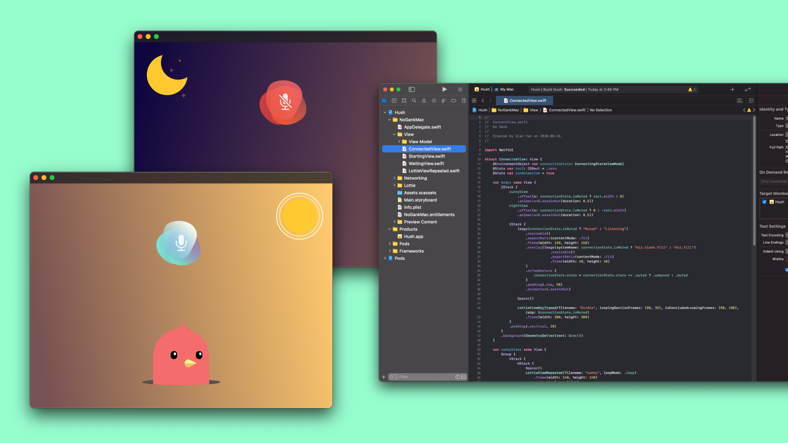
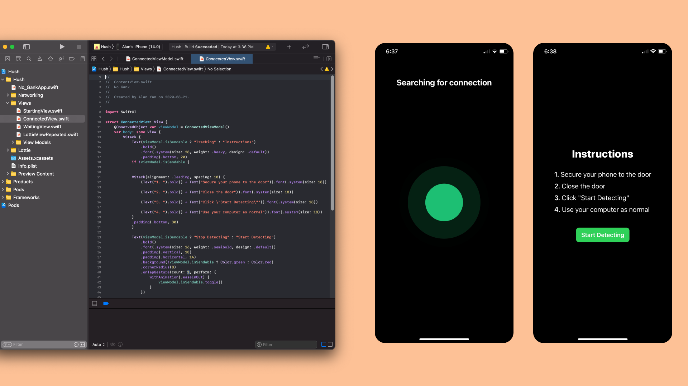

## Screenshots

## Inspiration

Throughout high school, our team and other friends regularly called each other for many purposes. However, our parents coming into our rooms for various reasons would always lead to embarrassing moments in the call. Moving forward into university and starting our careers, the concurrent Covid-19 pandemic has amplified this problem to all workers around the world. We developed Hush to tackle concurrent and past issues that we faced in the past.

## What it does

Hush is an application that makes sure your mic listens to only what you want it to. It connects a mobile device to your desktop and mutes our computer microphone when the mobile device detects movement of the door to your room.

## How we built it

Hush was built using the Swift and integrations with Slack were deployed using autocode.

## Challenges we ran into

Our inexperience building macOS applications made it a challenge to get the application working with smooth animations. Networking between iOS and macOS with MultipeerConnectivity with auto connection was quite challenging.

## Accomplishments that we're proud of

As first time hackers, we’re really proud to have successfully made something that works and is practical.

## What we learned

This was the first time our team had used autocode but we found it to be such an amazing platform. We were able to get the Slack bot connected to our Slack channel rather quickly. Setting up the webhook was also very simple. Many of us see ourselves using autocode in the future for fast prototyping and integrations.

## What's next for Hush

This is a proof of concept that solves the problem at hand. However, many individuals will prefer to have their phones by their side. With this in mind, if we were to create a real, marketable product, it would be in the form of a small, single-button device that can be easily attached to any door. The device would be cheap to produce requiring only an accelerometer and Bluetooth pairing capabilities.
